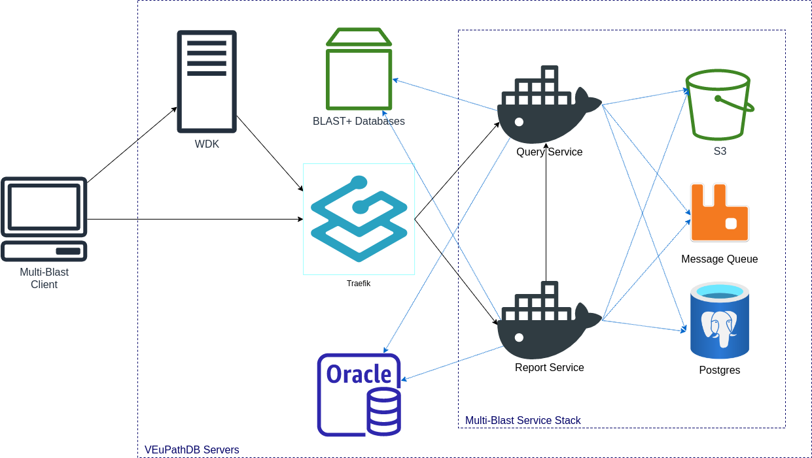
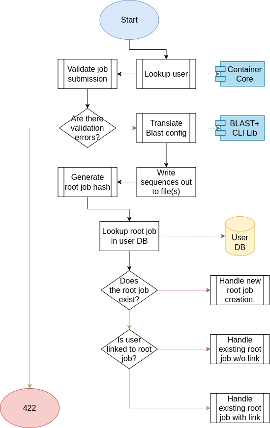

= Multi-Blast 2.0 Design
:source-highlighter: highlightjs
:toc: preamble
:var-github-url: https://github.com
:var-git-org-url: {var-github-url}/VEuPathDB

== The Stack

The Multi-Blast 2.0 service stack consists of 4 containers and 3 external
dependencies.

.Containers
1. The <<Query Service>>
2. The <<Report Service>>
3. A RabbitMQ message queue
4. A PostgreSQL database

.Dependencies
1. The VEuPathDB Oracle user database.
2. The VEuPathDB link:https://blast.ncbi.nlm.nih.gov/Blast.cgi[BLAST+]
   databases.
3. An S3 instance with a bucket created for each of the Query Service and Report
   Service.

== Query Service

The Query Service, built on the
link:{var-git-org-url}lib-compute-platform[Async Platform], exposes a REST API
through which API consumers may create, customize, and execute asynchronous
link:https://blast.ncbi.nlm.nih.gov/Blast.cgi[BLAST+] query jobs against
VEuPathDB's BLAST+ databases.

link:https://veupathdb.github.io/service-multi-blast/service-query/api.html[REST API Documentation]

The results of jobs executed through the query service will be cached for a
configurable amount of time before they are automatically expired.

.Query Service Overview
image:assets/mblast-query-overview.png[]

=== Actions

[%header, cols="2,1,7"]
|===
| Action | Source | Description

| <<#list-query-jobs,List Jobs>>
| Client
| Lists the query jobs that are <<job-to-user-links,linked>> to the requesting
  user.

| <<#create-query-job,Create Job>>
| Client
| Creates a new query job and may optionally link the new job to the requesting
  user.

| <<#lookup-query-job,Lookup Job>>
| Client
| Get the details and configuration for an existing job and optionally link the
  requesting user to the target job.

| <<restart-query-job,Restart Job>>
| Client
| Re-runs an existing job that has expired.

| <<update-query-job,Update Job>>
| Client
| Update a user's metadata attached to a job.

| <<delete-query-job,Delete Job>>
| Client
| Unlink a job from the requesting user.

| <<get-job-query,Get Job Query>>
| Client
| Retrieve the raw query submitted for a target job.

| <<get-job-result,Get Job Result>>
| Client
| Retrieve the ASN1 query result of the target job.

| <<get-job-errors,Get Job Errors>>
| Client
| Retrieve the stderr output for a target job.

| <<bulk-query-status,Bulk Status Check>>
| Client
| Check the current statuses for a batch of job IDs.

| <<Get All Targets>>
| Client
| List the BLAST+ databases currently visible to the service.

| <<link-query-guest,Link Guest>>
| Client
| Links the jobs associated with a guest user with a target non-guest user.

| <<Execute Query>>
| Queue
| Asynchronously executes a BLAST+ query.
|===

[#list-query-jobs]
==== List Jobs

Look up the jobs that are linked to the requesting user.  Optionally, the
results may be filtered by project ID.

===== Workflow

image:assets/list-query-jobs.svg[]

===== Response

The response will be a list of entries representing jobs that are linked to the
requesting user.

Each item in the result list will include:

* job id
* job status
* project id
* user metadata

[#create-query-job]
==== Create Job

Creates a new job record if one does not already exist matching the POSTed
configuration.  See <<Job IDs>>.

===== Workflow

====== Overall

====== Job Config Validation

===== Result

The response will be an object containing the ID of the job that was created or
found.

[source, json]
----
{
  "<job-id-key>": "<job-id>"
}
----

[#lookup-query-job]
==== Lookup Job

Retrieves a detailed record for a specific target job which will include the
original configuration from which the job was created.

Additionally, as a simplistic form of job "sharing", users who make a request to
get a job's details may optionally be linked to the target job, adding it to the
requesting user's job collection.

To maintain compatibility with the legacy behavior of the `v0.x` and `v1.x`
Multi-Blast API, the job saving behavior is opt-out only and by default users
will be linked to jobs they request that they are not already linked to.

===== Workflow

image:assets/lookup-query-job.svg[]

===== Result

The response will be an object describing the requested job, this  object will
include:

* job id
* job status
* job configuration:
** target BLAST+ databases
** target project id
* blast configuration
* user metadata

[#restart-query-job]
==== Restart Job

Restarts an expired job.  Once a job has expired from the cache, users are
allowed to re-run the job without needing to resubmit the configuration.

The configuration for the job is stored and will be resubmitted to the job queue
the same as if the job was brand new.

===== Workflow

image:assets/restart-query-job.svg[]

[#update-query-job]
==== Update Job

Updates the metadata a user has associated with a target job to which they are
already linked.

===== Workflow

image:assets/update-query-job.svg[]

[#delete-query-job]
==== Delete Job

Removes a target job from the user's job collection, deleting the link between
the user and the target job.

===== Workflow

. Look up the target job in the user database
. Verify the requesting user is linked to the target job
. Delete the link between the requesting user and the target job

[#get-job-query]
==== Get Job Query

Retrieves the query submitted for a job.

===== Workflow

image:assets/get-query-job-query.svg[]

[#get-job-result]
==== Get Job Result

Retrieves the ASN1 query result generated by a query job that has completed
successful.

===== Workflow

image:assets/get-query-job-result.svg[]

[#get-job-errors]
==== Get Job Errors

Retrieves the stderr output from the BLAST+ command-line tool that was executed
as part of a job.

===== Workflow

image:assets/get-query-job-errors.svg[]

[#bulk-query-status]
==== Bulk Status Check

The bulk status check takes a JSON array of job IDs as input, and for each valid
ID in the input, returns the job status in a map.

All job IDs that are found to be invalid will be ignored and will not appear in
the result status map.

===== Workflow

===== Result

A JSON object containing key/value pairs of query job ID mapped to job status.

[source, json]
----
{
  "<job-id[0]>": "<status>",
  "<job-id[1]>": "<status>",
  "<job-id[2]>": "<status>"
}
----

==== Get All Targets

Returns a tree of all the queryable BLAST+ databases that are available to use.

===== Workflow

===== Result

[source, json]
----
{
  "<project-id>": {
    "<target-name>": [
      "<target-db>",
      "<target-db>"
    ]
  }
}
----

[#link-query-guest]
==== Link Guest

RPC-like API endpoint used to migrate ownership of jobs created by a WDK guest
user to a logged-in user.  The use case being situations where a user creates
jobs before either realizing they weren't logged in, or deciding to create an
account.

===== Workflow

. Verify the target user from which jobs will be migrated is actually a WDK
  guest user.
. Verify the requesting user to which jobs will be migrated is actually a
  logged-in WDK user.
. Transfer user link ownership from the guest user to the logged-in user for all
  jobs linked to the guest.

==== Execute Query

Internal, asynchronous execution of a target BLAST+ command-line tool using a
user provided configuration.

This execution happens in worker threads that pull jobs from the RabbitMQ
message queue backing the Async Platform.

===== Workflow

===== Result

The result of the job execution will be a CLI call exit code and a list of files
that will be persisted to S3 by the Async Platform.

=== Dependencies

S3::
S3 is used to store a temporary cache of query job inputs and outputs.

RabbitMQ::
RabbitMQ is used to queue up query jobs for eventual execution.

PostgreSQL::
PostgreSQL is used as a backing database for queue and job history bookkeeping.

Oracle::
The permanent store of job configurations and user to job-links are stored in
the Oracle user database.

BLAST+ Databases::
BLAST+ database files that are the targets of user queries.  These have to be
mounted into the running container for the service to be able to access them.

== Report Service

The Report Service, built on the
link:{var-git-org-url}lib-compute-platform[Async Platform], exposes a REST API
through which API consumers may generate custom reports from BLAST+ queries
executed using the <<Query Service>>.

link:https://veupathdb.github.io/service-multi-blast/service-report/api.html[REST API Documentation]

.Report Service Overview
image:assets/mblast-report-overview.png[]

=== Actions

[%header, cols="2,1,7"]
|===
| Action | Source | Description

| <<list-report-jobs,List Jobs>>
| Client
| Lists the jobs that are linked to the requesting user.

| <<create-report-job,Create Job>>
| Client
| Creates a new report job and may optionally link the new job to the requesting
  user.

| <<create-report-job,Lookup Job>>
| Client
| Get the details and configuration for an existing job.

| <<restart-report-job,Restart Job>>
| Client
| Re-runs an existing job that has expired.

| <<update-report-job,Update Job>>
| Client
| Update a user's metadata attached to a job.

| <<delete-report-job,Delete Job>>
| Client
| Unlink a job from the requesting user.

| <<list-report-job-files,List Job Outputs>>
| Client
| List the report files generated by a target job.

| <<get-report-job-file,Get Job Output>>
| Client
| Retrieve a report file generated by a target job.

| <<get-report-job-error,Get Job Errors>>
| Client
| Retrieve the stderr output for a target job.

| <<bulk-report-check,Bulk Status Check>>
| Client
| Check the current statuses for a batch of job IDs.

| <<link-report-guest,Link Guest>>
| Client
| Links the jobs associated with a guest user with a target non-guest user.

| <<execute-report,Execute Report>>
| Queue
| Executes the BLAST+ CLI tool `blast_formatter` using a target query job's
  result as the input.
|===

[#list-report-jobs]
==== List Jobs

Looks up the jobs that are linked to the requesting user.  Optionally the
results may be filtered by query job ID.

===== Workflow

. Look up the jobs attached to the requesting user in the user database.
. Optionally filter results by query job ID.
. Look up statuses of result jobs from the Async Platform
. Return the list of items which include:
* report job id
* query job id
* job status
* user metadata

[#create-report-job]
==== Create Job

Creates a new job if one does not already exist matching the POSTed
configuration.

If the job did not previously exist, or was previously expired, it will be
queued to be executed.

===== Workflow

. Validate the job configuration
. Validate the status of the target query job
. Hash the config and query job ID to generate a job ID
. Verify no matching job already exists in the database
. Record the job in the user database
. Optionally link the requesting user to the job in the user database
. Submit the job to the Async Platform
. Return the generated job ID

[#lookup-report-job]
==== Lookup Job

Retrieves a detailed record for a specific target job which will include the
original configuration from which the job was created.

Additionally, as a simplistic form of job "sharing", users who make a request to
get a job's details may optionally be linked to the target job, adding it to the
requesting user's job collection.

To maintain compatibility with the legacy behavior of the `v0.x` and `v1.x`
Multi-Blast API, the job saving behavior is opt-out only and by default, users
will be linked to jobs they request that they are not already linked to.

===== Workflow

. Look up job in the user database
. Optionally link the requesting user to the job in the user database
. Check the status of the job
. Return the job details which will include:
* report job id
* query job id
* job status
* blast configuration
* user metadata

[#restart-report-job]
==== Restart Job

Restarts an expired job.  Once a job has expired from the cache, users are
allowed to re-run the job without needing to resubmit the configuration.

The configuration for the job is stored and will be resubmitted to the job queue
the same as if the job was brand new.

===== Workflow

. Look up job in the user database
. Verify requesting user is linked to the target job
. Verify the job status is "expired"
. Resubmit the job to the Async Platform

[#update-report-job]
==== Update Job

Updates the metadata a user has associated with a target job to which they are
already linked.

===== Workflow

. Look up the target job in the user database
. Verify the user is linked to the target job
. Update the user's metadata for the job in the user database

[#delete-report-job]
==== Delete Job

Removes a target job from the user’s job collection, deleting the link between
the user and the target job.

===== Workflow

. Look up the target job in the user database
. Verify the requesting user is linked to the target job
. Delete the link between the requesting user and the target job

[#list-report-job-files]
==== List Job Outputs

Lists the files generated by a completed report job.

===== Workflow

. Look up the target job in S3
. Verify the job's status is "complete"
. Return the list of result files

[#get-report-job-file]
==== Get Job Output

Retrieves the target file generated by a completed report job.

===== Workflow

. Look up the target job in S3
. Verify the job's status is "complete"
. Verify the target file exists in the job workspace
. Return the target file

[#get-report-job-error]
==== Get Job Errors

Retrieves the stderr output from the BLAST+ command-line tool that was executed
as part of a job.

===== Workflow

. Look up the target job in S3
. Verify the job's status is either "complete" or "failed"
. Return the job's stderr file

[#bulk-report-check]
==== Bulk Status Check

Looks up a bulk batch of job statuses for the jobs whose IDs were requested.

===== Workflow

===== Result

A JSON object containing key/value pairs of query job ID mapped to job status.

[source, json]
----
{
  "<job-id[0]>": "<status>",
  "<job-id[1]>": "<status>",
  "<job-id[2]>": "<status>"
}
----

[#link-report-guest]
==== Link Guest

Migrates the ownership of links between a target guest user and a target job to
be owned by a logged-in user.  The use case being situations where a WDK user
creates jobs before either realizing they weren't logged in, or deciding to
create an account.

===== Workflow

. Verify the target user from which jobs will be migrated is actually a WDK
  guest users.
. Verify the requesting user to which jobs will be migrated is actually a
  logged-in WDK user.
. Transfer user link ownership from the guest user to the logged-in user for all
  jobs linked to the guest.

[#execute-report]
==== Execute Report

Internal, asynchronous execution of the BLAST+ formatter command-line tool using
a user provided configuration.

This execution happens in worker threads that pull jobs from the RabbitMQ
message queue backing the Async Platform.

===== Workflow

. Download the job configuration from S3
. Download the query job result from the <<Query Service>>
. Translate the report config to a CLI call
. Execute the BLAST+ `blast_formatter` tool
. Record the stderr output to file
. Persist the generated files to S3
. Post the exit code back to the response channel of the message queue.

=== Dependencies

Query Service::
The query service is used to retrieve the result of the target query job on
which a report will be run.

S3::
S3 is used to store a temporary cache of query job inputs and outputs.

RabbitMQ::
RabbitMQ is used to queue up query jobs for eventual execution.

PostgreSQL::
PostgreSQL is used as a backing database for queue and job history bookkeeping.

Oracle::
The permanent store of job configurations and user to job-links are stored in
the Oracle user database.

== Concepts

=== Parent & Child Jobs

When submitting a query to the Multi-Blast service, if the config is valid, one
or more jobs will be created.  One job will be created for the entire input, and
child jobs may be created for each individual sequence in the input query.

If the input query contains only one sequence, only one job will be created, a
"parent" job with no children.

If the input query contains multiple sequences, a parent job will be created for
the overall input, and a child job will be created for each individual sequence
in the input.

Child jobs are linked to the parent job from which they were created.

==== Single Sequence

.Single-Sequence Query
[source]
----
> First
IYSLVCWPLDDPFSRPDMLSLSERMLDVWRGKQVAEDLSPLINQLSLADMIRSCERNETL
----

.Resulting Jobs:
--
[cols="1,7"]
|===
| Name | Sequences

| Parent Job 1
| First
|===
--

==== Multi-Sequence

.Multi-Sequence Query
[source]
----
> First
IYSLVCWPLDDPFSRPDMLSLSERMLDVWRGKQVAEDLSPLINQLSLADMIRSCERNETL
> Second
QKQRAYLRSMEEKARERRRIFIQNEQARLERFAKERAERQTTTTTTTTATTPTTTTPTTT
TPTTTPTTTKAPGIP
> Third
YRPQNSSVDTVTSEQSIPVWMYGLVLLLLLSVGLLTCLSLLLSYKLKQLKVASCADSSTA
TSEPFHNVYVTTSSHYSSPYGLRREVPASPRCPPSPYPVFFKEPFVNMTA
----

.Resulting Jobs:
--
[cols="1,7"]
|===
| Name | Sequences

| Parent Job 1
| First, Second, Third

| Child Job 1
| First

| Child Job 2
| Second

| Child Job 3
| Third
|===
--

[#job-to-user-links]
=== Job to User Links

TODO

* Jobs may be linked to users
* When creating a job, only the parent job is linked
* Job link contains user metadata
* When accessing a job's details, a user may optionally be linked to a job
  regardless of whether it is a parent job or child job
* Only jobs that are linked to the requesting user will be returned in list
  endpoints.
* User metadata is stored on the job-to-user link

=== Job IDs

A job ID is a hash of the job's configuration and query.  This means that if the
same configuration is submitted multiple times, the resulting job ID will be the
same every time.

==== For the Query Service

For the <<Query Service>>, the generated job IDs are dependent on:

* the BLAST+ query tool configuration
* the target project ID
* the input query text
* the selected query targets
** the name of the target
** the name of the database file

==== For the Report Service

For the <<Report Service>>, the generated job IDs are dependent on:

* the ID of the query service job for which the report will be generated
* the BLAST+ formatter tool configuration

== Metrics

The following metrics are gathered from the Multi-Blast services:

=== Common Metrics

Metrics common to both the query and report services.

[cols="1m,1,1a,2"]
|===
| Name | By | Params | Description

| http_total_requests
| jaxrs-container-core
| * HTTP method
  * path
  * response code
| Counter of requests.

| http_request_duration
| jaxrs-container-core
| * HTTP method
  * path
| Histogram of request durations.

| process_total_memory
| prometheus-jvm-stats
|
| Total memory allocated by the Java process

| process_free_memory
| prometheus-jvm-stats
|
| Unused allocated memory

| process_active_memory
| prometheus-jvm-stats
|
| Allocated memory currently in use

| gc_count
| prometheus-jvm-stats
|
| Total number of garbage collections

| gc_time
| prometheus-jvm-stats
|
| Total time used by the garbage collector
|===

=== Query Service

Metrics specific to the query service.

[cols="1m,1a,3"]
|===
| Name | Params | Description

| blast_command_time_millis
| * BLAST+ tool
| BLAST+ CLI tool execution time in milliseconds.
|===

=== Report Service

Metrics specific to the report service.

[cols="1m,1a,3"]
|===
| Name | Params | Description

| blast_command_time_millis
| * BLAST+ tool
| BLAST+ CLI tool execution time in milliseconds.
