= Multi-Blast Service
:author: Elizabeth Harper <epharper@upenn.edu>
:revnumber: 1
:toc: left
:icons: font
:source-highlighter: pygments
:pygments-style: monokai

== Goal

Expose an API allowing users to submit multi-sequence blast
queries against one or more VEuPathDB blast databases and
view/download the result in any of the blast+ supported
formats.

Additionally, due to the time and processor cost of running
these queries, the API should cache results and only ever
run unique or expired queries.  Multiple requests with
identical configurations should only result in 1 job being
created and cached.

== Architecture

The multi-blast project (mblast) consists of 6 Docker
containers and 2 volumes.  Additionally the project depends
on tables in an Oracle "user DB".

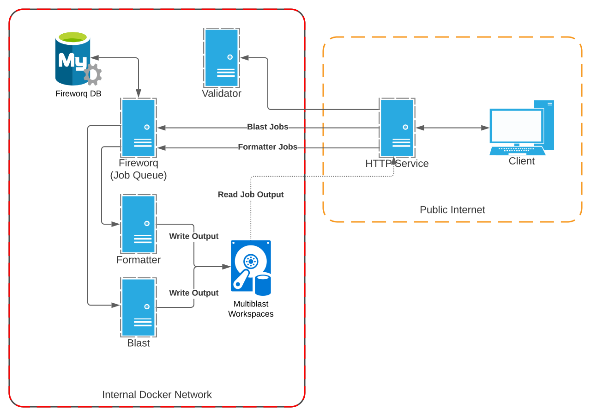

Of the 6 containers, only 1 is exposed publicly and handles
all communications with external clients.  The remaining
containers communicate internally on a Docker managed
private network.

The containers are:

. The publicly exposed HTTP server
. A job queue server (https://github.com/fireworq/fireworq[Fireworq])
. A queue persistance database (MySQL)
. 2 NCBI/Blast containers with internal HTTP services
. A blast config validation service

The volumes used are 1 shared volume containing the mblast
workspaces, and 1 mounted filesystem containing the target
blast databases.

=== Containers

==== Public HTTP Server

This container is the root or primary service for the
project and orchestrates the operations for the other
services.

The responsibilities for this service include:

* Authenticating user requests
* Applying VEuPathDB specific validation to blast configurations.
* Submitting jobs to the Fireworq queue.
* Reading and writing data from/to the Oracle user DB.

===== Exposed Endpoints

https://veupathdb.github.io/service-multi-blast/api.html[Full API Documentation]

.Endpoint Overview
[cols="2m,1m,4"]
|===
| Endpoint | Method | Purpose

| /api
| GET
| Prints API Docs

| /health
| GET
| Prints service health

| /jobs
| GET\|POST
| List or create blast jobs

| /jobs/{:jobID}
| GET\|POST
| View or rerun an individual blast job

| /jobs/{:jobID}/query
| GET
| Retrieve a blast job's query text

| /meta
| GET
| Prints a tree of available target Blast DBs

| /metrics
| GET
| Prints https://prometheus.io/[Prometheus] service metrics

| /reports
| GET\|POST
| List or create report jobs

| /reports/{:jobID}
| GET\|POST
| View or rerun an individual report job

| /reports/{:jobID}/files/{:filename}
| GET
| View or download a generated report
|===

==== "Blast" Server

The blast container is based on the
https://hub.docker.com/r/ncbi/blast[`ncbi/blast` Docker image]
and is extended with a simple HTTP server that accepts a
configuration via a `POST` request and returns a Fireworq
compatible response.

The server translates the posted configuration into a CLI
call to a target blast+ CLI tool with all output stored in a
job specific workspace.

===== Internal Endpoints

https://veupathdb.github.io/service-multi-blast/querier-api.html[Full API Documentation]

.Endpoint Overview
[cols="2m,1m,4"]
|===
| Endpoint | Method | Purpose

| /blast
| POST
| Run a blast+ tool with the given configuration

| /metrics
| GET
| Prints https://prometheus.io/[Prometheus] service metrics

|===

==== "Formatter" Server

The formatter container is based on the
https://hub.docker.com/r/ncbi/blast[`ncbi/blast` Docker image]
and is extended with a simple HTTP server that accepts a
configuration via a `POST` request and returns a Fireworq
compatible response.

The server translates the posted configuration into a CLI
call to `blast_formatter` run against the blast results
present in the job specific workspace.  All output is stored
in a subdirectory of that workspace.

===== Internal Endpoints

https://veupathdb.github.io/service-multi-blast/formatter-api.html[Full API Documentation]

.Endpoint Overview
[cols="2m,1m,4"]
|===
| Endpoint | Method | Purpose

| /report
| POST
| Runs `blast_formatter` with the given config
|===

==== Validation Server

A simple server that validates the POSTed configuration
against the rules outlined in the blast+ tool help
documentation.

==== Queue Server

The queue container is a custom image that pulls in a target
Fireworq version along with a
https://github.com/VEuPathDB/util-fireworq-init[custom initialization tool]
that ensures the job queues are set up correctly.

==== Queue DB

A small MySQL server managed by Fireworq.  This DB is
populated on init by the scripts in `./databases/queue/ddl`
in the repository root.

=== Database

In addition to the 6 containers the mblast project also uses
several tables currently parked in the Oracle user DB.

The definitions for these tables can be found in
`./databases/wdk/user-tables.sql`.

.`multiblast_jobs`
[%collapsible]
====
Root blast job table.

[cols="1m,1m,4"]
|===
| Column | Type | Purpose

| job_digest
| byte[16]
| Primary key (digest of the job configuration)

| job_config
| clob
| Parsed job configuration

| query
| clob
| input query string

| queue_id
| int(7)
| ID of the job in the Fireworq queue.  This value is
  updated when jobs are re-run.

| project_id
| varchar(16)
| Project ID for the site the job was run on.

| status
| varchar(10)
| Last known status for the job.  This value is updated only
  when a client requests info about a job from the service. +
  **WARNING**: This column is for internal service usage and
  cannot be used to accurately derive overall assessments.
  For example, it is a normal case for this field to
  indicate that a job is "queued" when in reality the job
  has completed or failed.

| created_on
| timestamptz
| Timestamp for the job creation.

| delete_on
| timestamptz
| (DEPRECATED) timestamp for when the job will "expire".
  This column is not currently used and should be dropped in
  a later update.
|===
====

.`multiblast_job_to_targets`
[%collapsible]
====
Table linking mblast jobs to target blast DBs.

[cols="1m,1m,4"]
|===
| Column | Type | Purpose

| job_digest
| byte[16]
| Foreign key to `multiblast_jobs.job_digest`

| organism
| varchar(256)
| Organism name WDK internal value

| target_file
| varchar(256)
| Target blast DB
|===
====

.`multiblast_job_to_jobs`
[%collapsible]
====
Table linking mblast jobs to one another (job hierarchy).

[cols="1m,1m,4"]
|===
| Column | Type | Purpose

| job_digest
| byte[16]
| Child job digest. Foreign key to `multiblast_jobs.job_digest`

| parent_digest
| byte[16]
| Parent job digest. Foreign key to `multiblast_jobs.job_digest`

| position
| int(4)
| Position of a child job under it's parent job.
|===
====

.`multiblast_users`
[%collapsible]
====
Table linking users to mblast jobs.  (More than one user may
be linked to a single job).

[cols="1m,1m,4"]
|===
| Column | Type | Purpose

| job_digest
| byte[16]
| Foreign key to `multiblast_jobs.job_digest`

| user_id
| int(12)
| WDK Site user ID.

| description
| varchar(1024)
| User provided description for the job this record links
  to.

| max_download_size
| int(12)
| Max size (in bytes) a client is willing to handle for a
  job result.

| run_directly
| bool
| Indicates whether the user intentionally and directly ran
  this job, or if it was created as a sub-job or by another
  service.
|===
====

.`multiblast_fmt_jobs`
[%collapsible]
====
[cols="1m,1m,4"]
|===
| Column | Type | Purpose

| report_digest
| byte[16]
| Primary key.  Digest of the report configuration.

| job_digest
| byte[16]
| Foreign key to `multiblast_jobs.job_digest`

| status
| varchar(10)
| Last known status for the job.  This value is updated only
  when a client requests info about a job from the service. +
  **WARNING**: This column is for internal service usage and
  cannot be used to accurately derive overall assessments.
  For example, it is a normal case for this field to
  indicate that a job is "queued" when in reality the job
  has completed or failed.

| config
| clob
| Parsed report configuration.

| queue_id
| int(7)
| ID of the job in the Fireworq queue.  This value is
  updated when jobs are re-run.

| created_on
| timestamptz
| Timestamp for the job creation.
|===
====

.`multiblast_users_to_fmt_jobs`
[%collapsible]
====
[cols="1m,1m,4"]
|===
| Column | Type | Purpose

| report_digest
| byte[16]
| Foreign key to `multiblast_fmt_jobs.report_digest`

| user_id
| int(12)
| WDK Site user ID.

| description
| varchar(1024)
| User provided description for the job this record links
  to.
|===
====

== Workflow

.Flowchart Legend
[%collapsible]
====
image::assets/legend.svg[]
====

=== Blast Jobs

==== Universal Processes

Processes that are used by many if not all of the various
endpoints.

.Job ID Hash Validation
[%collapsible]
====
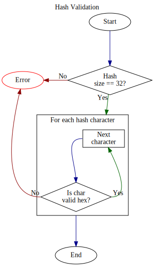
====

.Lookup User Job
[%collapsible]
====
The process "Lookup User Job" appearing in the flowcharts in
this doc refers to a query that attempts to lookup a full
job record already attached to the target user.  If no such
record is found, it only tells us that the user is not
linked to such a job, but it does not tell us whether the
job actually exists.

If "Lookup User Job" process does not find any matching
rows, then the process moves on to attempting to find just
the job with no user links.

A pseudo-query describing the intent of this process could
be defined as:

[source, sql]
----
SELECT *
FROM jobs_table AS job
  JOIN user_links_table AS user
    ON job.job_id = user.job_id
WHERE
  job.job_id = ?
  AND user.user_id = ?
----
====

.Refresh Job Status
[%collapsible]
====
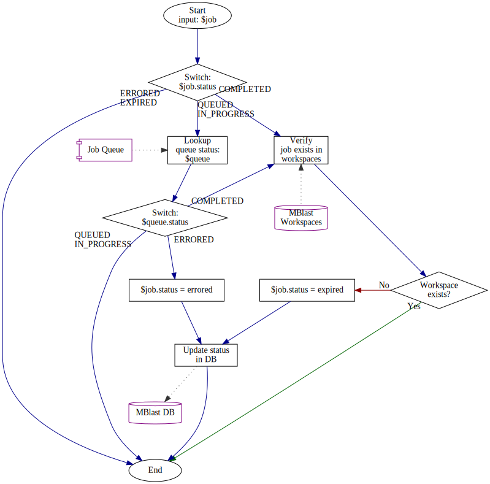
====

==== Job Submission

.Basic Blast Workflow (Sequence Diagram)
[%collapsible]
====
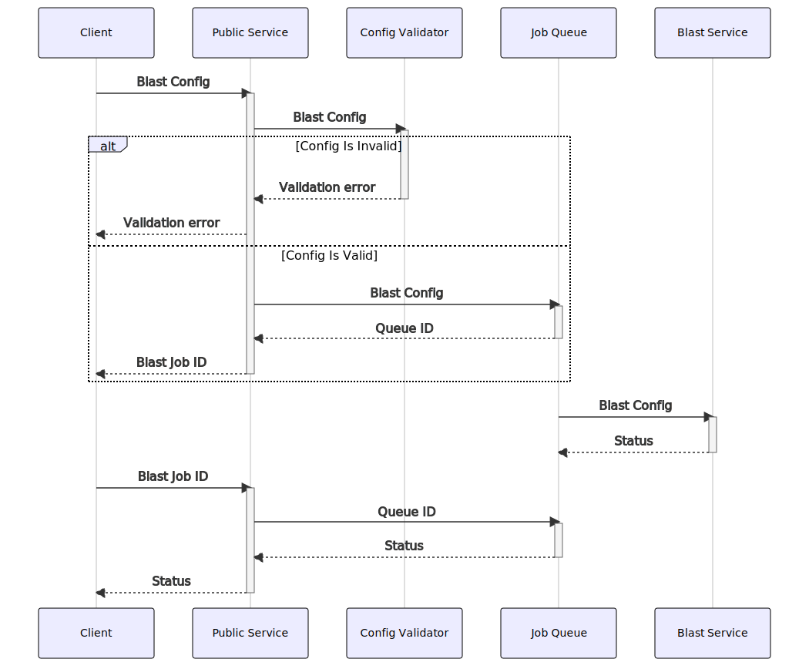
====

.Request Validation Process
[%collapsible]
====
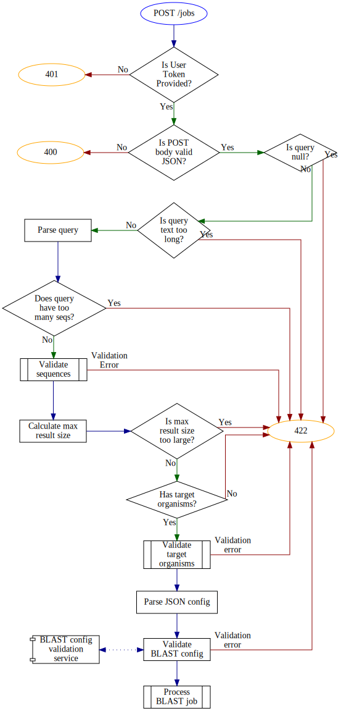
====

.Sequence Validation Process
[%collapsible]
====
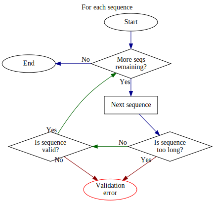
====

.Calculate Max Result Size
[%collapsible]
====
The max allowed results for a query is configured either by
the client making the request, or a value configured at
service startup.  If the client's requested max result size
exceeds the value from the service configuration, the
configured default will be used.

Once the max is determined, the projected size of the result
is calculated based on the following.
[source, java]
----
// Input values
var inputSequenceCount;
var jobConfig;

if (jobConfig.getMaxTargetSeqs() != null)
  return jobConfig.getMaxTargetSeqs() * inputSequenceCount;

if (jobConfig.getNumDescriptions() != null)
  return jobConfig.getNumDescriptions() * inputSequenceCount;

if (jobConfig.getNumAlignments() != null)
  return jobConfig.getNumAlignments() * inputSequenceCount;
----
====

.Target Organism Validation Process
[%collapsible]
====
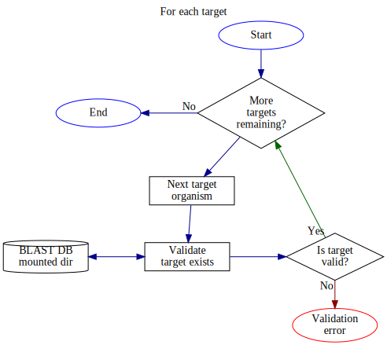
====

.Blast Submission Process
[%collapsible]
====
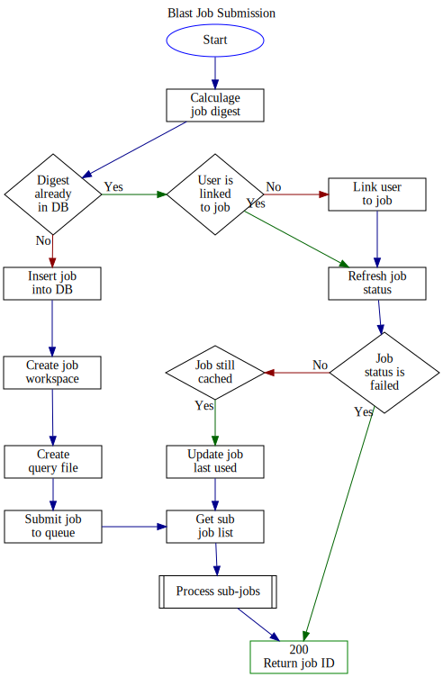
====

.Sub-Job Submission Process
[%collapsible]
====
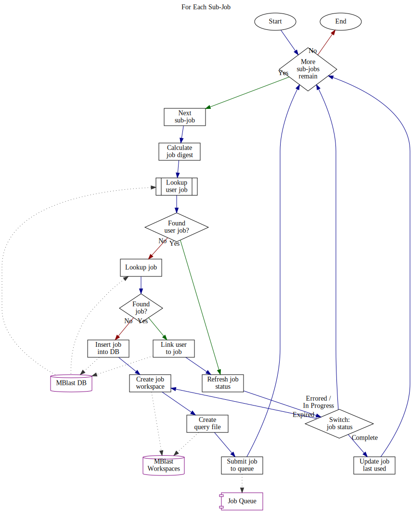
====

==== Job Lookup

.Job Lookup Process
[%collapsible]
====
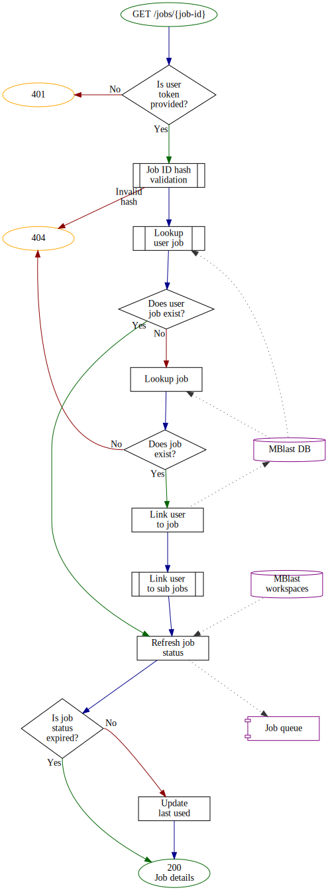
====

.Job ID Hash Validation
[%collapsible]
====

====

.Get and Link User Job
[%collapsible]
====
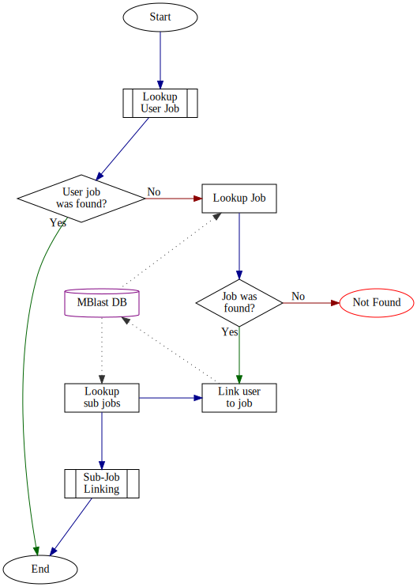
====

.Refresh Job Status
[%collapsible]
====

====

.Refresh Sub-Job Status
[%collapsible]
====
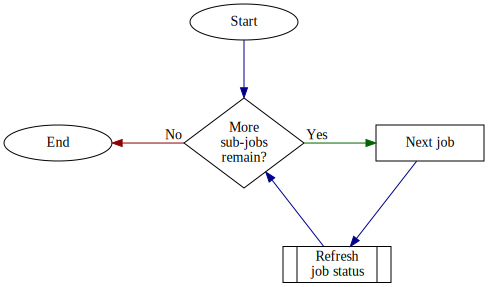
====

.Sub-Job Linking
[%collapsible]
====
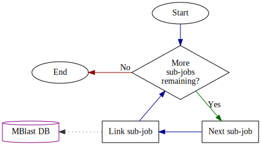
====

==== Job Resubmission

.Job Resubmission Process
[%collapsible]
====
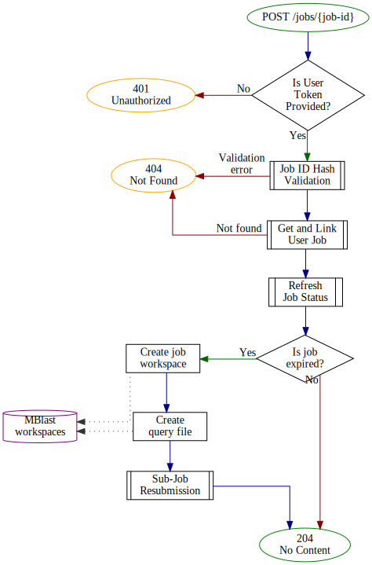
====

.Job ID Hash Validation
[%collapsible]
====

====

.Get and Link User Job
[%collapsible]
====

====

.Sub-Job Resubmission
[%collapsible]
====
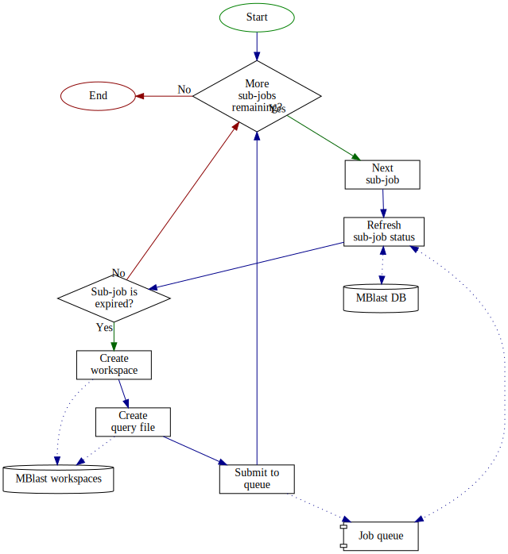
====

.Sub-Job Linking
[%collapsible]
====

====

=== Formatter Jobs

==== Report Job Submission

.Basic Formatter Workflow
[%collapsible]
====
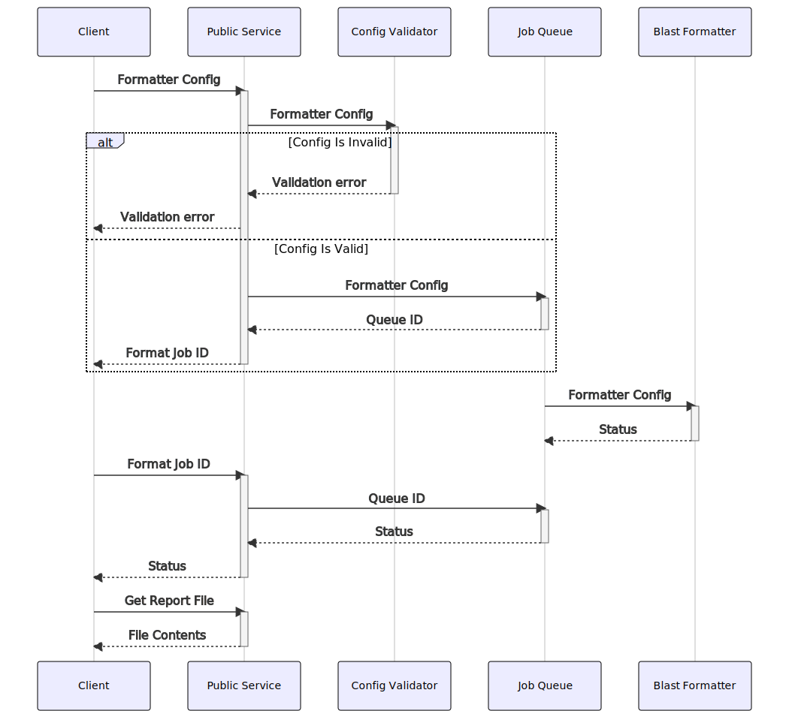
====

.Request Overview
[%collapsible]
====
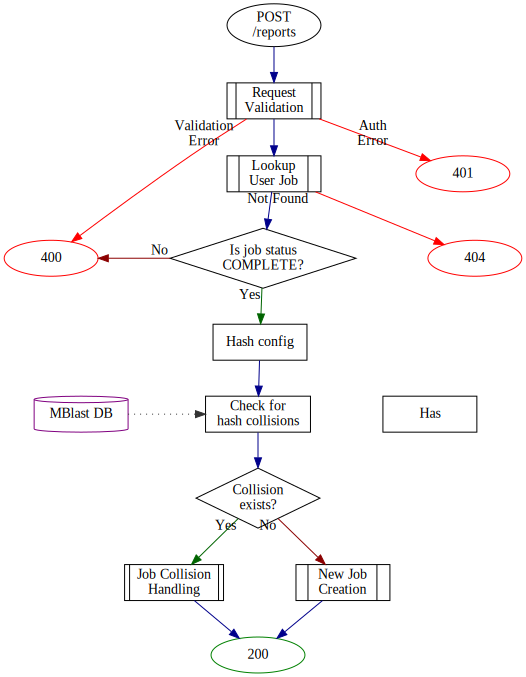
====

.Request Validation
[%collapsible]
====
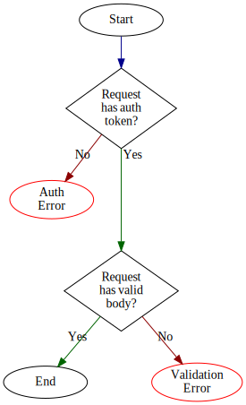
====

.Get and Link User Job
[%collapsible]
====

====

.Sub-Job Linking
[%collapsible]
====

====

== Other Topics

=== Job Splitting/Hierarchy

When a multi-sequence job is submitted to the mblast
service, multiple jobs are created.  One for the full query,
then an additional "child" job is created for each
individual sequence in the query.  By default, child jobs
are marked as non-primary which may be used by clients to
render child jobs differently than the full parent job.

Additionally, a job may be marked as non-primary on creation
which may be used by indirect or non-UI clients to create
jobs without polluting a user's created job list.

To the mblast service, there is functionally no difference
between a child job and a parent job.  Both run through the
same steps and are queued and processed as individual jobs.
The job hierarchy and primary status are purely for client
use and have no impact on how the service functions.

=== Hashing/Job Collisions

To avoid storing/running multiple identical jobs, each job
(both blast and formatter) is indexed on an MD5 digest of
the config (excluding client-only fields such as
`description` and `isPrimary`).

When a blast or formatter job is submitted, it's config is
parsed, validated, then serialized to JSON.  That JSON is
used to generate the job digest.  If another job was found
in the DB with the same hash, instead of running the
submitted job, the user is marked as an owner of the
pre-existing job and that job digest is returned as normal.

If the user is linked to a job that has expired, the job is
re-run, which means that any other user linked to that job
will see the job's status changes as it runs through the
process again.

=== Workspaces

The job workspace volume is divided into 3 layers of
directories, the job root directory containing individual
blast job workspaces, the blast job workspaces containing
the blast tool inputs and outputs in addition to the report
workspaces, which contain report job output.

The directory name for the job workspaces is the MD5 blast
job digest (primary key), and the directory name for the
report workspaces is the MD5 report job digest.

.Workspace Volume
====
----
/
└─ jobs/
    ├─ 9bfbb6c2885bdc1875ff315afd034f61/ <1>
    │    ├─ error.txt <2>
    │    ├─ log.txt <3>
    │    ├─ query.txt <4>
    │    └─ report.asn1 <5>
    ├─ b9e9407be6a1262cf1815635b3c99f74/ <6>
    │    ├─ d57b025af8832914cc8fcc4ead3bf965/ <7>
    │    │    ├─ meta.json <8>
    │    │    ├─ report.xml <9>
    │    │    └─ report.zip <10>
    │    ├─ error.txt
    │    ├─ log.txt
    │    ├─ query.txt
    │    └─ report.asn1
    ├─ f6b1992fd18bbfd9daa4b4af8caa04c7/ <11>
    │    ├─ error.txt
    │    ├─ log.txt
    │    └─ query.txt
    └─ a022e6a3a418793b90bf34c852361352/ <12>
         └─ query.txt
----
<1> Workspace for a job that completed successfully, with no
    reports yet run against it.
<2> Text file containing the stderr output from the blast+
    tool execution.  This file should be empty for a
    successful run.
<3> Text file containing the stdout output from the blast+
    tool execution.
<4> The blast job query which may be one or more sequences.
<5> The blast job output in the NCBI blast asn1 format.
<6> Workspace for a job that both completed successfully and
    had one report job run against it.
<7> Workspace for an individual report job.
<8> JSON file containing a listing of the files available to
    the user(s) who own this report.
<9> Raw `blast_formatter` output in the user selected
    format.  There may be more than one file depending on
    the selected format.
<10> Zip file containing all output files from the
    `blast_formatter` run.
<11> Workspace for a blast job that failed.
<12> Workspace for a blast job that has not yet run.
====

=== Job Statuses

Blast and report jobs will be in one of 5 possible statuses:

Queued::
  The job and its workspace has been created but the job has
  not yet been pulled from the queue to run.
In Progress::
  The job has been pulled from the queue and is actively
  running.
Errored::
  An unexpected error occurred while attempting to run the
  blast job.
Completed::
  The job completed successfully.
Expired::
  The job completed successfully but its cached results have
  been deleted.  Job will re-run when requested.

The status returned at runtime is derived from the status
stored in the user DB in combination with the queue status
and the status of the job's workspace in the mounted volume.

The following pseudocode roughly describes the process used
to determine a job's status.

.Pseudocode
[%collapsible]
====
[source, javascript]
----
if job.getDbStatus() == "errored"
  return "errored"

if job.getDbStatus() == "expired"
  return "expired"

if job.getDbStatus() == "completed"
  if job.getWorkspace().exists() == true
    return "completed"
  else
    return "expired"

if job.getDbStatus() == "in-progress"
  if job.checkIsRunning() == true
    return "in-progress"
  else
    if job.checkIsFailed() == true
      return "errored"
    else if job.getWorkspace().exists() == true
      return "completed"
    else
      return "expired"

if job.getDbStatus() == "queued"
  if job.checkIsInQueue() == true
    return "queueud"
  else if job.checkIsRunning() == true
    return "in-progress"
  else if job.checkIsFailed() == true
    return "errored"
  else if job.getWorkspace().exists() == true
    return "completed"
  else
    return "expired"
----
====

A job status is stored in the user DB, but is only updated
when the job's details are requested.  This means that the
unless the status in the DB is "errored" or "expired", that
status is probably not up to date.

WARNING: The `status` column present in both the blast job
and report job mblast tables in the Oracle user DB is not
expected to reflect the actual status of a job.  It is used
internally along with several other factors to derive the
status of a job when needed.

=== Job Expiration

Jobs that have completed are cached, and that cache is
subject to deletion at a set time period from the last time
the job was accessed.  By default this timeout is 5 days,
however this value may be changed at runtime from external
configuration.

The "last access" date is tracked by using the last modified
date on the workspace directory.  When a job is accessed,
the last modified timestamp on the workspace is updated to
the time of the accessing.

Job cleanup happens at a set interval and runs through and
deletes all workspace directories that have a last modified
date outside of the set timeout window.

=== User Authentication

The mblast service accepts a WDK session token like most of
the other VEuPathDB containerized services, but additionally
allows requests to be made using just a WDK user ID to
enable WDK "guest" users to run blast jobs.

Authentication is done via an HTTP header `Auth-Key`.  This
key should contain the token or user ID.